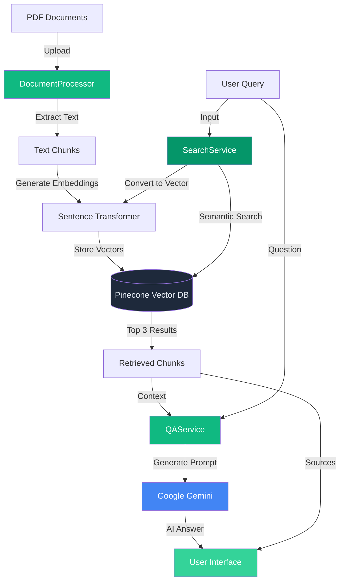

# 🌱 ESG Question Answering System

<div align="center">


**AI-Powered Sustainability Insights from ESG Documents**

[](https://www.python.org/)
[](https://streamlit.io/)
[](https://www.pinecone.io/)
[](https://ai.google.dev/)

</div>

---

## 📋 Table of Contents

- [Overview](#-overview)
- [Features](#-features)
- [Architecture](#-architecture)
- [How It Works](#-how-it-works)
- [Installation](#-installation)
- [Running the Project](#-running-the-project)
- [Usage](#-usage)
- [Screenshots](#-screenshots)
- [Technology Stack](#-technology-stack)
- [Project Structure](#-project-structure)
- [Contributing](#-contributing)

---

## 🌍 Overview

The **ESG Question Answering System** is an intelligent application that enables users to ask questions about Environmental, Social, and Governance (ESG) practices and receive AI-powered answers based on company sustainability reports. The system uses advanced semantic search and large language models to provide accurate, source-grounded responses.

### Key Capabilities:
- 🔍 **Semantic Search**: Find relevant information using natural language queries
- 🏢 **Company Filtering**: Search across all companies or filter by specific organization
- 📤 **Document Upload**: Add new ESG reports to expand the knowledge base
- 🤖 **AI-Powered Answers**: Get detailed 200-400 word answers from Google Gemini
- 📊 **Source Citations**: View top 3 relevant sources with relevance scores

---

## ✨ Features

### 1. **Intelligent Question Answering**
Ask natural language questions about ESG topics and receive comprehensive answers based on actual company documents.

### 2. **Company-Specific Search**
Filter search results by specific companies or search across all available ESG documents.


### 3. **Document Upload & Processing**
Upload new PDF documents which are automatically:
- Extracted for text content
- Split into semantic chunks
- Converted to vector embeddings
- Stored in Pinecone vector database


### 4. **Transparent Source Display**
View the top 3 most relevant document chunks with:
- Relevance scores
- Company attribution
- Text previews

### 5. **Beautiful, Modern UI**
- Gradient-based emerald green theme
- Smooth animations and hover effects
- Responsive design
- Intuitive user experience

---

## 🏗️ Architecture

The system consists of three main components working together:



---

## 🧠 How It Works

### 1️⃣ **Document Processing** (`src/services/document_processor.py`)

**Purpose**: Convert PDF documents into searchable vector embeddings

**Process**:
1. **Extract Text**: Read PDF files using `pdfplumber`
2. **Create Chunks**: Split text into 800-character chunks with 100-character overlap
3. **Generate Embeddings**: Convert chunks to 1024-dimensional vectors using `intfloat/e5-large-v2` model
4. **Store in Database**: Upsert vectors to Pinecone with metadata (company name, text content)

```python
# Simplified workflow
processor = DocumentProcessor()
text = processor.extract_text_from_pdf(pdf_path)
chunks = processor.chunk_text(text, chunk_size=800, overlap=100)
# Model encodes and stores automatically
processor.process_and_store_pdf(pdf_file)
```

**Why Chunking?**
- Maintains context while keeping manageable sizes
- Overlap ensures no information loss at boundaries
- Optimal for semantic search performance

---

### 2️⃣ **Semantic Search** (`src/services/search_service.py`)

**Purpose**: Find the most relevant document chunks for a user's query

**Process**:
1. **Convert Query**: Transform user's question into a vector embedding
2. **Search Database**: Query Pinecone for similar vectors using cosine similarity
3. **Filter by Company** (optional): Apply metadata filter for specific company
4. **Retrieve Top K**: Get top 3 most relevant chunks with scores

```python
# Simplified workflow
search_service = SearchService()
results = search_service.semantic_search(
    user_query,
    top_k=3,
    company_name="Infosys"  # Optional
)
```

**Semantic Search Benefits**:
- Understands intent, not just keywords
- Finds contextually relevant information
- Works with synonyms and related concepts

---

### 3️⃣ **AI Answer Generation** (`src/services/qa_service.py`)

**Purpose**: Generate comprehensive, grounded answers using retrieved context

**Process**:
1. **Prepare Context**: Combine top 3 chunks into formatted context
2. **Create Prompt**: Build detailed prompt with rules and structure
3. **Call Gemini API**: Send context + query to Google Gemini 2.0 Flash
4. **Return Answer**: Get detailed 200-400 word response

```python
# Simplified workflow
qa_service = QAService()
answer = qa_service.generate_answer(user_query, top_chunks)
```

**Answer Quality Features**:
- Only uses provided sources (no hallucination)
- Structured 200-400 word responses
- Includes specific data points and timelines
- Cites source companies

---

## 📥 Installation

### Prerequisites
- Python 3.12 or higher
- Pinecone account with API key
- Google Gemini API key

### Step 1: Clone the Repository
```bash
git clone <repository-url>
cd Capestone
```

### Step 2: Install Dependencies
```bash
pip install -r requirements.txt
```

### Step 3: Configure Environment Variables
Create a `.env` file in the project root:

```env
PINECONE_API_KEY=your_pinecone_api_key_here
GEMINI_API_KEY=your_gemini_api_key_here
```

### Step 4: Setup Pinecone Index
Create a Pinecone index named `capstone` with:
- **Dimensions**: 1024
- **Metric**: Cosine similarity
- **Cloud**: Your preferred region

---

## 🚀 Running the Project

### Option 1: Run the Streamlit App (Recommended)

```bash
streamlit run src/app.py
```

The application will open automatically in your browser at `http://localhost:8501`

### Option 2: Process Documents Using Script

```bash
python scripts/process_documents.py
```

This will process all PDF files in the `data/pdfs/` folder and upload them to Pinecone.

### Option 3: Command-Line Query Interface

```bash
python scripts/query_cli.py
```

This provides an interactive terminal-based question-answering interface.

### Option 4: Using Legacy Files (Backward Compatibility)

```bash
# Legacy Streamlit app
streamlit run app.py

# Legacy document  processing
python vector.py

# Legacy query interface
python userquery.py

# Legacy search testing
python searchingmodel.py
```

---

## 📖 Usage

### 1. **Ask Questions**

1. Navigate to the **"Ask Questions"** tab
2. Select a company from the dropdown (or choose "General" for all companies)
3. Enter your ESG-related question
4. Click **"Search & Answer"**
5. Review the top 3 relevant sources and AI-generated answer


**Example Questions**:
- "What are the carbon emission reduction targets?"
- "How does the company address water conservation?"
- "What diversity and inclusion initiatives are mentioned?"
- "What renewable energy commitments have been made?"

### 2. **View AI-Generated Answers**

The system provides detailed, contextual answers with:
- Direct answers to your question
- Specific data points and numbers
- Timelines and targets
- Company attributions


### 3. **Upload New Documents**

1. Navigate to the **"Upload Documents"** tab
2. Click **"Choose a PDF file"**
3. Select an ESG report or sustainability document
4. Click **"Process & Store"**
5. Wait for processing confirmation

---

## 📸 Screenshots

### Main Interface


### Company Filter Dropdown


### Top 3 Search Results


### AI-Generated Answer


---

## 🛠️ Technology Stack

### Frontend
- **Streamlit**: Web application framework
- **Custom CSS**: Gradient themes, animations, responsive design

### Machine Learning
- **Sentence Transformers**: `intfloat/e5-large-v2` for embeddings
- **Google Gemini 2.0 Flash**: Large language model for answer generation

### Vector Database
- **Pinecone**: Cloud-native vector database for semantic search

### Document Processing
- **pdfplumber**: PDF text extraction
- **Python**: Core programming language

### Dependencies
```
streamlit==1.52.2
sentence-transformers
pinecone-client
pdfplumber
python-dotenv
google-genai
```

---

## 📁 Project Structure

```
Capestone/
├── src/                           # Main source code package
│   ├── __init__.py
│   ├── app.py                     # Streamlit application (entry point)
│   ├── config/                    # Configuration management
│   │   ├── __init__.py
│   │   └── settings.py            # Centralized settings
│   ├── services/                  # Business logic services
│   │   ├── __init__.py
│   │   ├── document_processor.py  # PDF → Chunks → Vectors → DB
│   │   ├── search_service.py      # Semantic search functionality
│   │   └── qa_service.py          # LLM-based Q&A generation
│   └── utils/                     # Utility functions
│       ├── __init__.py
│       └── helpers.py             # Shared helper  functions
├── data/                          # Data directory
│   └── pdfs/                      # ESG PDF documents
│       ├── Infosys.pdf
│       ├── Reliance Industries Limited.pdf
│       ├── Mahindra & Mahindra.pdf
│       └── ... (more PDFs)
├── docs/                          # Documentation
│   └── screenshots/               # Application screenshots
├── tests/                         # Unit and integration tests
│   ├── __init__.py
│   └── test_services.py
├── scripts/                       # Standalone scripts
│   ├── process_documents.py       # Bulk document processing
│   └── query_cli.py               # CLI query interface
├── .env                           # Environment variables (not in repo)
├── .gitignore                     # Git ignore file
├── requirements.txt               # Python dependencies
└── README.md                      # This file
```

### Legacy Files (Backward Compatibility)
```
├── app.py                         # Legacy entry point (use src/app.py instead)
├── vector.py                      # Legacy processor (use src/services/document_processor.py)
├── searchingmodel.py              # Legacy search (use src/services/search_service.py)
└── userquery.py                   # Legacy Q&A (use src/services/qa_service.py)
```

---

## 🎨 Design Philosophy

### Color Palette
- **Primary**: `#10b981` (Emerald Green) - Represents sustainability
- **Secondary**: `#059669` (Dark Emerald) - Accent and depth
- **Background**: `#0f172a` (Dark Slate) - Modern, professional
- **Cards**: `#1e293b` (Slate) - Content containers

### UI/UX Principles
1. **Visual Hierarchy**: Important information stands out
2. **Feedback**: Clear indicators for all user actions
3. **Accessibility**: High contrast, readable fonts
4. **Responsiveness**: Works on different screen sizes
5. **Delight**: Smooth animations and transitions

---

## 🔧 Configuration

### Centralized Settings

All configuration is now centralized in `src/config/settings.py`:

```python
# API Credentials
PINECONE_API_KEY = os.getenv("PINECONE_API_KEY")
GEMINI_API_KEY = os.getenv("GEMINI_API_KEY")

# Search Configuration
TOP_K = 3                # Number of search results
CHUNK_SIZE = 800         # Characters per chunk
OVERLAP = 100            # Overlap between chunks
INDEX_NAME = "capstone"  # Pinecone index name

# Model Configuration
EMBEDDING_MODEL = "intfloat/e5-large-v2"  # Embedding model
LLM_MODEL = "gemini-2.0-flash-exp"        # LLM model
```

**Embedding Model**:
- Current: `intfloat/e5-large-v2` (1024 dimensions)
- Alternatives: `all-MiniLM-L6-v2`, `all-mpnet-base-v2`

**LLM Model**:
- Current: `gemini-2.0-flash-exp`
- Config key: `LLM_MODEL` in `src/config/settings.py`

---

## 📊 Performance Metrics

### Search Performance
- **Average Query Time**: 2-3 seconds
- **Embedding Generation**: ~100ms per query
- **Pinecone Query**: ~500ms
- **LLM Response**: 1-2 seconds

### Document Processing
- **Processing Speed**: ~10-20 pages/second
- **Chunking**: Nearly instant
- **Embedding Generation**: ~1-2 seconds per document
- **Upload to Pinecone**: ~500ms per batch

---

## 🤝 Contributing

Contributions are welcome! Here's how you can help:

1. **Report Bugs**: Open an issue describing the bug
2. **Suggest Features**: Propose new features via issues
3. **Submit PRs**: Fork, create a branch, and submit a pull request
4. **Improve Docs**: Help enhance documentation

---

## 📝 License

This project is created for educational purposes as part of a capstone project.

---

## 🙏 Acknowledgments

- **Sentence Transformers** by UKPLab for semantic embeddings
- **Pinecone** for vector database infrastructure
- **Google Gemini** for advanced language model capabilities
- **Streamlit** for the amazing web framework

---

## 📞 Support

For issues, questions, or suggestions:
- Open an issue on GitHub
- Contact the development team

---

<div align="center">

**Built with ❤️ for Sustainable Future**

🌱 ESG Question Answering System | 2026

</div>
